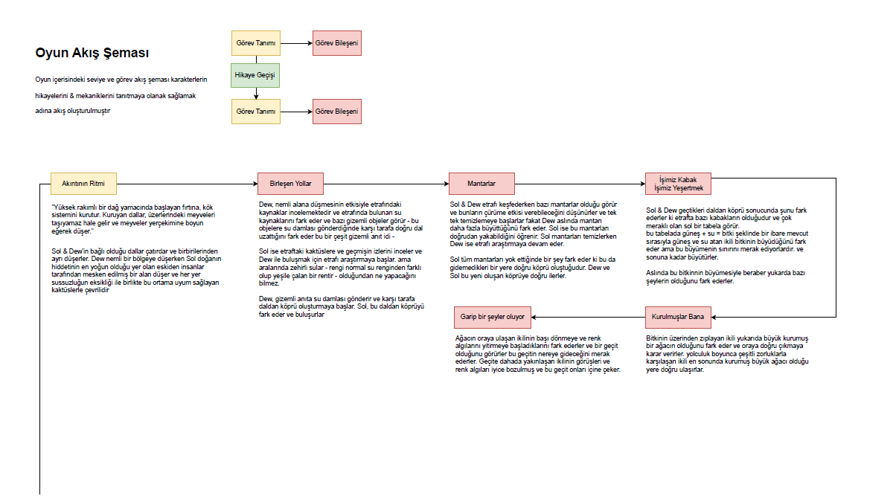
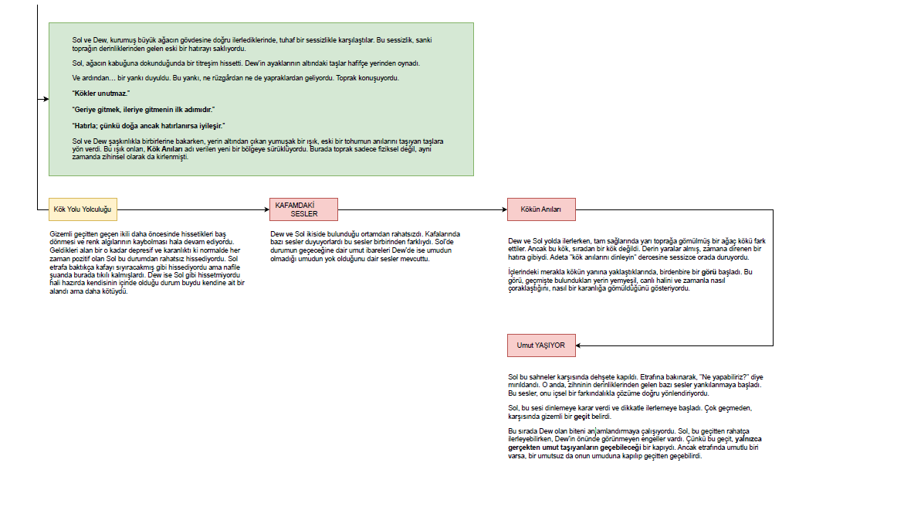

# **Tohum Etkisi**

---

## Oyun Türü
- Co-op Puzzle Adventure  
- Ortam Etkileşimli Mini-Oyunlar  

---

## 🌱 Oyun Açıklaması

**Sol ve Dew**, doğanın yeniden canlandırılması temasını işleyen iki oyunculu bir bulmaca/macera oyunudur. Sol (güneşi temsil eden) ve Dew (suyu temsil eden) adlı iki çilek karakteri, doğanın bozulmuş ekosistemine hayat vermeye çalışırlar.

---

## 📖 Ana Hikaye

Oyun, Sol ve Dew'in bağlı oldukları dalların çatırdayıp ikiliyi farklı bölgelere düşürmesiyle başlar. Sol kurak, kaktüslerle dolu çorak bir alana düşerken, Dew nemli bir bölgeye düşer. Her iki karakter de kendi yeteneklerini kullanarak tekrar birleşmeye çalışır.

---

## ⚙️ Temel Mekanikler

- **Su ve Güneş Kombinasyonu**: Sol ateş/ışık yetenekleri kullanırken, Dew su damlacıkları gönderir
- **Çevresel Bulmacalar**: Mantarları temizleme (Sol yakarken Dew büyütür), bitkileri büyütme (güneş + su = büyüme), köprü inşa etme
- **Gizemli Anıtlar**: Dew'in su göndermesiyle dal köprüleri oluşturan yapılar
- **Ritimsel Etkileşim**: "Akıntının Ritmi" bölümünde görüldüğü gibi doğal döngülere dayalı oynama tarzı

---

## 🗺️ Bölüm Yapısı

1. **Akıntının Ritmi**: Karakterlerin ayrılması ve çevreye uyum sağlaması
2. **Birleşen Yollar**: Su anıtları ve dal köprüleri ile yeniden buluşma
3. **Mantarlar**: Çürüme temizleme ve yeni yollar açma
4. **İşimiz Kabak/Yeşertmek**: Bitki büyütme bulmacaları
5. **Kurulmuşlar Bana**: Büyük kurumuş ağaca çıkış ve geçit keşfi
6. **Kök Yolu**: Depresif ortamda içsel seslerle mücadele
7. **Kök Anıları**: Geçmişin izlerini takip ederek umut bulma

---

## 🎮 Oyun Deneyimi

Oyun, iki oyuncunun senkronize çalışmasını gerektiren çevresel bulmacalar, her karakterin benzersiz yeteneklerini kullanarak doğanın tahrip olmuş kök sistemini onarma süreci ve psikolojik derinlik (umut/umutsuzluk, içsel sesler, geçmiş anıları) temaları etrafında şekillenir.

Bu oyun sadece çevresel bir mesaj vermekle kalmaz, aynı zamanda işbirliği, umut ve doğanın döngüsel yapısını anlama konularında da oyunculara deneyim sunar.

---

## 🔄 Oyun Akışı

Aşağıda oyunun temel seviye akışını gösteren şema yer alır:

**Oyun Akışı Diyagramı**  

[Oyun Akışı PDF](../Diyagramlar/oyunakis.pdf)

> Tüm görevler soldan sağa zaman çizgisiyle ilerler.

---

## 📂 İçerik Sayfaları

| 📁 Kategori | Açıklama |
|-------------|----------|
| **📘 GDD** | Bu ana döküman, projenin tüm yapısını üstten sunar. |
| **📖 Hikaye** | Oyunun evreni, karakter arka planları ve seviye anlatımları.  |
| **👥 Karakterler** | Sol & Dew'in yetenekleri, davranışları ve evrimsel gelişimleri.  |
| **🧩 Mekanikler** | Tüm etkileşim sistemleri, oynanış mekaniği, mini-oyunlar ve kurallar.  |
| **📣 Pazarlama** | Oyun ismi, pazarlama dili, duygusal vurgu, potansiyel kitlesi ve tanıtım araçları. |
| **🗺️ Seviyeler** | Her bölümün adı, temasal içeriği, temel mekanik yapısı ve hedefleri. |

---